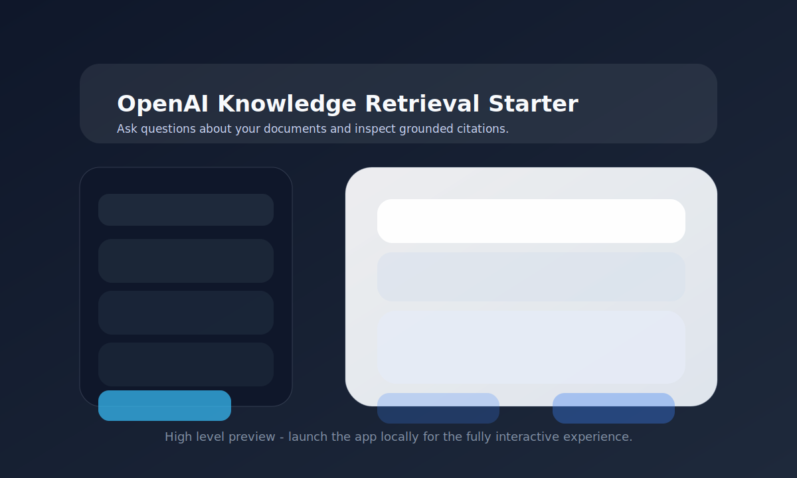

# OpenAI Knowledge Retrieval


Config-first RAG starter kit that pairs OpenAI File Search, Chatkit, and Evals with a
pluggable ingestion, retrieval, and evaluation toolkit.



## Quickstart

Launch a working knowledge retrieval app in a few commands:

```bash
# 1. Backend environment
python3 -m venv .venv
source .venv/bin/activate
make dev                # or: make install

# 2. Credentials
cp .env.example .env
echo "OPENAI_API_KEY=sk-..." >> .env

# 3. Update configuration
# Edit the configuration in configs/default.openai.yaml to point to your documents.

# 4. Ingest corpus
make ingest

# 5. Run backend + frontend (in separate terminals)
make run-app-backend

# 6. Run frontend (in another terminal)
make run-app-frontend

# 7. Open <http://localhost:5172> to chat with the assistant. All answers are grounded with citations that link back to the ingested documents.

# 8. Evals: Generate synthetic data for evaluation and upload to OpenAI Evals
make eval
```

## Features

- **YAML-first configuration** – define ingestion, retrieval, and synthesis behavior without editing
  code.
- **Multiple vector stores** – ship with OpenAI File Search or go custom with a local Qdrant DB.
- **Typed pipelines** – ingestion, retrieval, and synthesis flows built with Pydantic models and
  Typer/FastAPI services.
- **ChatKit UI** – Leverage Chatkit components for interacting with the knowledge base.
- **Evaluation harness** – Generate synthetic data and run evals with OpenAI Evals or local grading.

## Repository Structure

- `cli/` – Typer CLI (`rag`) entrypoint and config parsing.
- `ingestion/` – loaders, chunkers, preprocessors, and orchestrated pipelines.
- `retrieval/` – query expansion, filtering, reranking, and response assembly.
- `stores/` – adapters for OpenAI File Search and custom vector stores (Qdrant example included).
- `app/backend/` – FastAPI application that powers the chat API.
- `app/frontend/` – Vite + React UI using Tailwind CSS and ChatKit components.
- `configs/` – starter default YAMLs you can copy and customize.
- `evals/` – evaluation harness, dataset generation, and reporters.
- `templates/` – additional templates for different vector stores, chunking strategies, and retrieval methods.
- `prompts/` – prompts for the different aspects of the knowledge retrieval workflow (query, expansion, reranking, local judging, etc.)

## Pipeline Setup
To do a more custom implementation beyond the quickstart, you can follow the steps below.

### 1. Prerequisites

- Python 3.10 or later
- Node.js 18.18 or later (for the optional web UI)
- An OpenAI API key (`OPENAI_API_KEY`) with access to File Search and Evals

### 2. Install backend dependencies

```bash
python3 -m venv .venv
source .venv/bin/activate
make dev  # or: make install
```

### 3. Configure credentials

Copy `.env.example` to `.env` and fill in the values that apply to your environment. At minimum set
`OPENAI_API_KEY`. Optional variables:

```bash
OPENAI_ORG_ID=...
OPENAI_PROJECT_ID=...
VECTOR_STORE_ID=vs_...
```

### 4. Create a configuration

Use the CLI to copy a YAML config template into `configs/` (replace `my` with a project name):

```bash
rag init --template openai > configs/my.openai.yaml
```

Templates include `openai` and `custom-qdrant`, along with different options for chunking data. Adjust `data.paths` to point at the documents you
want to ingest. Example datasets live in `data/example_data/`.

Add your config to the `RAG_CONFIG` environment variable.

### 5. (Optional) Spin up your qdrant vector store in docker

```bash
make qdrant-up
```

This will start a local Qdrant instance on port 6333.

### 6. Ingest your knowledge base

```bash
rag ingest --config configs/my.openai.yaml
```

The CLI will create or reuse a vector store, upload documents, and print the resulting
`vector_store_id`. Persist that value in your `.env`.

### 7. Launch the experience

Start the FastAPI backend (reads `RAG_CONFIG`, defaulting to `configs/default.openai.yaml`):

```bash
make run-app-backend
```

Start the web UI in another terminal:

```bash
make run-app-frontend
```

The UI runs at <http://localhost:5172> by default and communicates with the backend at
<http://localhost:8000>.

### 8. Evaluate retrieval quality

```bash
rag eval --config configs/my.openai.yaml
```

The harness can either use an existing dataset (`evals.mode: user`) or synthesize one (`evals.mode: auto`)
When `evals.openai_evals.enabled: true`, results are mirrored to the OpenAI Evals dashboard.

## Configuration & Customization

Every aspect of the pipeline is driven by YAML. Use `rag init --template <name>` to scaffold a
config, then customize the sections described below.

### Templates

- `openai` – Default template backed by OpenAI File Search. Works out of the box with the supplied
  example dataset.
- `custom-qdrant` – Connects to a locally hosted Qdrant instance. Pair with `make qdrant-up` to start
  Docker services automatically.

Add `--chunking <strategy>` when scaffolding to pick a predefined chunking approach (see next
section).

### Chunking strategies

Chunking is controlled under `chunking` in the config:

- `recursive` – Recursively backs off from headings to paragraphs, sentences, then tokens to hit the
  target window.
- `heading` – Uses heading hierarchy (`#`, ALL CAPS, numbered headings) to keep coherent sections.
- `hybrid` – Falls back to recursive when headings are missing (default).
- `xml_aware` – Purpose-built for XML manuals; splits on semantic tags and converts tables to
  Markdown.
- `custom` – Load a custom chunker via `custom_chunker.{module_path,class_name,init_args}`.

Common parameters:

- `target_token_range: [min, max]` – Token window to aim for before chunking stops.
- `overlap_tokens` – Overlap between adjacent chunks to maintain context.
- `rules` – Strategy-specific options (heading detection hints, XML tag boundaries, etc.).

### Vector store configuration

Select your store with `vector_store.backend`:

- `openai_file_search` – Managed vector store that handles uploads, dedupe, and metadata. Configure:
  - `vector_store_name`
  - `vector_store_id` (reuse an existing store instead of creating a new one)
  - `expiry_days`, `chunking.max_chunk_size_tokens`, `chunking.chunk_overlap_tokens`
- `custom` – Bring your own implementation. The included Qdrant adapter is enabled with:

  ```yaml
  vector_store:
    backend: custom
    custom:
      kind: qdrant
      qdrant:
        url: http://localhost:6333
        collection: my_collection
        distance: cosine
        ef: 64
        m: 32
  ```

You can reference your own module by setting `custom.kind: plugin` and providing
`plugin.{module_path,class_name,init_args}`. This will allow you to supply any vector db of your choice.

### Retrieval pipeline

Four optional stages live under `query`:

- `query.expansion.enabled` – Uses an LLM to generate alternate phrasings. Configure `model`,
  `prompt_path`, `variants`, and `style`.
- `query.hyde.enabled` – Adds HyDE (Hypothetical Document Embeddings); an LLM writes a synthetic
  passage that is embedded alongside the query.
- `query.similarity_filter.enabled` – Drop results below a similarity `threshold` before reranking.
- `query.rerank.enabled` – Apply an LLM cross-encoder reranker; configure `model`, `prompt_path`,
  `max_candidates`, and `score_threshold`.

Prompts live under `prompts/expansion/`, `prompts/hyde/`, and `prompts/rerank/`. Edit those files to
change the guidance without touching code.

### Response synthesis

Under `synthesis` you can set:

- `model` – Response model (e.g., `gpt-4o-mini`, `o4-mini-high`, etc.).
- `system_prompt` – Inline string or a path to a prompt file (default lives at
  `prompts/system/assistant.md`).
- `structured_outputs` – Enable schema-based responses.
- `reasoning_effort` – Hint the model on effort (`low`, `medium`, `high`).

### Environment fallbacks

Use the `env` block to specify default values for credentials such as `OPENAI_API_KEY`,
`OPENAI_PROJECT_ID`, `VECTOR_STORE_ID`, etc. Actual environment variables override these when set.

## Frontend UI

The UI is built with Vite, React 19, Tailwind CSS, and `@openai/chatkit-react`. Helpful commands:

```bash
npm run dev      # start dev server with hot reload
npm run build    # create production bundle
npm run preview  # preview the production build locally
npm run lint     # eslint + typescript checks
```


## Evaluations & OpenAI Evals

The evaluation harness supports both local grading and hosted OpenAI Evals.

### Auto-generated datasets

Set `evals.mode: auto` to synthesize evaluation data from your corpus. The harness:

1. Samples ingested chunks.
2. Asks an LLM to create realistic user questions.
3. Stores the dataset under `evals/datasets/` (JSONL format).

Re-run the command to expand coverage or refresh stale questions.

### Curated datasets

Switch to `evals.mode: user` and provide `evals.dataset_path`. Each JSONL record should include:

- `id` – unique identifier.
- `question` – the user query.
- `citation_text` – supporting passage used for groundedness.
- `correct_answer`: ideal answer used for EM/F1 scoring (required)
- Metadata (e.g., `source_id`, `page`, `char_start`, `char_end`, `difficulty`, `tags`).

See `evals/datasets/schema.py` for the full schema; the CLI validates these fields before each run and canonicalizes answers internally for consistent scoring.

### Mirroring to OpenAI Evals

Keep `evals.openai_evals.enabled: true` to sync local runs to the hosted platform. Configure:

- `graders` – choose groundedness, relevance, or custom rubrics.
- `run_name` – friendly label for dashboards.
- `organization_id` / `project_id` – override defaults when needed.

Results are printed locally and reports are written to `evals/reports/` (Markdown, HTML, and any OpenAI Evals link stubs).

## Contributing

We welcome community contributions! Please read [`CONTRIBUTING.md`](CONTRIBUTING.md) for guidance on
how to file issues, propose changes, and follow our coding standards.

## Security

If you believe you have discovered a vulnerability, please refer to [`SECURITY.md`](SECURITY.md) for
responsible disclosure instructions. Do not open a public issue for security reports.

## License

This project is licensed under the [MIT License](LICENSE).

## Acknowledgements

- [FastAPI](https://fastapi.tiangolo.com/) for the backend framework.
- [ChatKit](https://github.com/openai/chatgpt-retrieval-plugin) components for the chat UI.
- [Lucide](https://lucide.dev/) icons (MIT licensed).
- [Tailwind CSS](https://tailwindcss.com/) utilities for styling.
